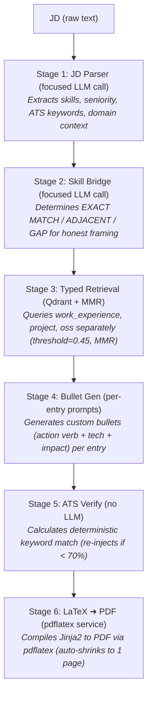

# TailorCV

**JD-aware resume generation using a multi-stage RAG pipeline.**

Paste a job description. TailorCV retrieves the most relevant slices of your career history from a vector store, runs them through a decomposed LLM pipeline, and compiles a single-page ATS-optimised PDF — tailored to that specific role.

---

## The problem with naive resume generators

Most LLM-based resume tools do one thing: dump your entire work history into a prompt and ask the model to pick what's relevant. This breaks in three ways:

- **Context pollution** — a single Qdrant query returns 15 chunks, 12 of which are from the same project
- **One-shot overload** — asking one LLM call to parse the JD, select projects, write bullets, score ATS, and output valid JSON simultaneously. Small models lose the thread.
- **No semantic typing** — work experience, personal projects, and OSS contributions land in the same retrieval pool, so the model conflates them

TailorCV fixes all three with a typed retrieval layer and a decomposed generation pipeline.

---

## How it works



The ATS score is computed deterministically — keyword match ratio against the parsed JD, not an LLM estimate.

---

## Stack

| Layer | Technology |
| --- | --- |
| Backend API | FastAPI |
| Frontend | React |
| Vector store | Qdrant |
| LLM | Gemma (via Ollama) |
| PDF generation | pdflatex + Jinja2 |
| Embeddings | `nomic-embed-text` |
| Database | PostgreSQL |
| Cache | Redis |
| Container | Docker / Docker Compose |

---

## Project structure

```text
rezume/
├── backend/
│   ├── app/
│   │   ├── api/            # FastAPI route handlers
│   │   ├── services/
│   │   │   ├── jd_parser.py        # Stage 1
│   │   │   ├── skill_bridge.py     # Stage 2
│   │   │   ├── retrieval.py        # Stage 3 — typed Qdrant queries
│   │   │   ├── generation.py       # Stage 4 — per-entry bullet gen
│   │   │   ├── ats_scorer.py       # Stage 5 — deterministic scoring
│   │   │   └── pdf_compiler.py     # Stage 6 — LaTeX → PDF
│   │   ├── models/
│   │   │   ├── work_entry.py       # WorkEntry with EntryType enum
│   │   │   └── user_skill.py       # Skill inventory with proficiency
│   │   └── templates/
│   │       └── resume.tex.j2       # Jinja2 LaTeX template
├── frontend/
│   └── src/
│       ├── pages/
│       │   ├── Profile.tsx
│       │   ├── Projects.tsx        # Entry type selector, date pickers
│       │   ├── Skills.tsx          # Skill inventory CRUD
│       │   └── Generate.tsx        # JD input + ATS breakdown
└── docker-compose.yml
```

---

## Running locally

**Prerequisites:** Docker, Docker Compose, [Ollama](https://ollama.com)

```bash
# Pull the models
ollama pull gemma3:12b
ollama pull nomic-embed-text

# Clone and start
git clone https://github.com/iamshobhraj/rezume.git
cd rezume
cp .env.example .env
docker compose up --build
```

App runs at `http://localhost:3000`. Qdrant dashboard at `http://localhost:6333/dashboard`.

### Add your career data

1. Go to **Profile** → fill in your details and education
2. Go to **Skills** → add your skill inventory with categories and proficiency levels
3. Go to **Projects** → add entries, selecting type: *Work Experience*, *Personal Project*, or *OSS Contribution*
4. Go to **Generate** → paste a JD and generate

---

## Key design decisions

**Why typed retrieval?**
A single semantic search over all entry types lets dominant projects (e.g. a detailed work internship) crowd out everything else. Separate queries with `payload_filter` on `entry_type` guarantee the model sees the right category of experience for each resume section.

**Why decompose the generation?**
Gemma 12B reliably handles a 400-token focused prompt. It does not reliably handle a 4000-token prompt that asks it to simultaneously parse a JD, reason about skill gaps, write achievement-oriented bullets, and produce valid JSON. Decomposition trades latency for quality — each stage is fast; the pipeline is not.

**Why deterministic ATS scoring?**
LLM-generated ATS scores are hallucinated. The model has no ground truth — it just produces a plausible-looking number. A simple keyword intersection over the parsed JD's `ats_keywords` list gives a real, reproducible score that can drive the refinement loop.

---

## What's next

- [ ] DPO fine-tuning on (good resume, bad resume) preference pairs once the pipeline is stable
- [ ] Quality scorer: embedding-distance model to rank multiple generated variants
- [ ] Export to DOCX alongside PDF
- [ ] Multi-template support (academic, design, quant finance)
- [ ] **Job crawler + auto-apply** — crawl LinkedIn, Naukri, and Wellfound for JDs matching a target role/location, score each against the user's skill inventory, auto-generate a tailored resume per JD, and submit applications via Playwright browser automation — turning TailorCV into a full outbound job search agent
