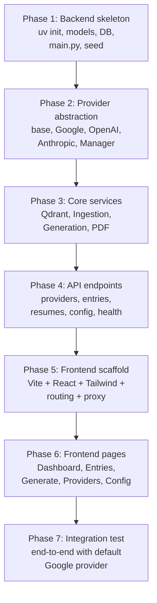

# Resume Intelligence Engine – Multi-Provider Edition

Build a web application that stores engineering work in persistent AI-readable memory and generates tailored, ATS-safe resume PDFs for specific job descriptions. Users can configure which LLM and embedding model to use via a frontend settings page.

---

## Architecture: Two Independent Services

The application is split into **two fully decoupled, separately runnable services**. Each service has its own dependency management, its own process, and can be containerized with a single `CMD` — no Dockerfile authoring required.

| Service | Runtime | Port | Package Manager | Start Command |
|---------|---------|------|-----------------|---------------|
| **Backend** | Python 3.10+ / FastAPI | `:8000` | `uv` (venv at `backend/.venv`) | `uv run uvicorn app.main:app --host 0.0.0.0 --port 8000 --reload` |
| **Frontend** | Node 26 / Vite + React | `:5173` | `npm` (`frontend/node_modules`) | `npm run dev -- --host 0.0.0.0` |

Communication: Frontend → Backend via `http://localhost:8000/api/...` (Vite dev proxy in development, reverse proxy in production).

### Dependency Isolation

- **Backend**: `uv init` creates `backend/pyproject.toml` + `backend/.venv/`. All Python packages live in the venv. Running any backend command is always `cd backend && uv run <cmd>`. The venv is created automatically by `uv sync`.
- **Frontend**: `npm install` creates `frontend/node_modules/`. Standard Node isolation.
- **No shared root package.json or pyproject.toml.** The repo root only has `.gitignore`, `README.md`, and `.env` (shared config read by the backend).

---

## User Review Required

> [!IMPORTANT]
> **pdflatex is not installed** on this system. LaTeX-based PDF generation requires `texlive`. I'll add a `weasyprint` (HTML→PDF) fallback so the app works without LaTeX. Is that acceptable, or should I skip PDF generation entirely until LaTeX is installed?

> [!IMPORTANT]
> **Qdrant Cloud**: The plan assumes you already have a Qdrant Cloud cluster URL and API key. These go in `.env`. If you prefer an in-memory or local Docker Qdrant, let me know and I'll adjust.

> [!WARNING]
> **Embedding dimension lock-in**: Once a Qdrant collection is created with a given vector dimension (e.g. 768 for Google, 1536 for OpenAI), switching embedding providers with a different dimension requires re-ingesting all data. The UI will show a warning banner when this situation is detected.

## Open Questions

1. **Authentication**: Should there be any user auth (even a simple API key gate), or is this purely a local single-user tool?
2. **LaTeX templates**: Do you have existing LaTeX resume templates, or should I create one from scratch?
3. **Qdrant mode**: Qdrant Cloud (free tier) or local Docker container?

---

## Project Structure

```
airesume/
├── .env                                  # Shared env vars (read by backend)
├── .gitignore
├── README.md
│
├── backend/                              # ── Python service (FastAPI) ──
│   ├── pyproject.toml                    # uv-managed, declares all Python deps
│   ├── .python-version                   # pins Python version for uv
│   ├── .env.example                      # template for required env vars
│   ├── app/
│   │   ├── __init__.py
│   │   ├── main.py                       # FastAPI app, lifespan, CORS, router mounts
│   │   ├── config.py                     # Pydantic Settings (reads ../.env)
│   │   ├── database.py                   # SQLAlchemy engine, session factory, Base
│   │   │
│   │   ├── models/                       # SQLAlchemy ORM models
│   │   │   ├── __init__.py               # re-exports all models for Base.metadata
│   │   │   ├── llm_provider.py
│   │   │   ├── work_entry.py             # WorkEntry + Chunk
│   │   │   ├── resume_config.py
│   │   │   └── generated_resume.py
│   │   │
│   │   ├── schemas/                      # Pydantic request/response schemas
│   │   │   ├── __init__.py
│   │   │   ├── provider.py
│   │   │   ├── work_entry.py
│   │   │   ├── resume.py
│   │   │   └── config.py
│   │   │
│   │   ├── providers/                    # LLM abstraction layer
│   │   │   ├── __init__.py
│   │   │   ├── base.py                   # ABC: generate(), embed(), test_connection()
│   │   │   ├── google_provider.py
│   │   │   ├── openai_provider.py        # Also covers Ollama / vLLM / custom
│   │   │   ├── anthropic_provider.py
│   │   │   └── manager.py               # Factory + dispatch + client cache
│   │   │
│   │   ├── services/                     # Business logic
│   │   │   ├── __init__.py
│   │   │   ├── ingestion.py              # chunk → extract metadata → embed → store
│   │   │   ├── generation.py             # JD → retrieve → prompt → resume JSON
│   │   │   ├── qdrant_service.py         # Collection CRUD, upsert, search
│   │   │   └── pdf_service.py            # LaTeX/Jinja2 → PDF (weasyprint fallback)
│   │   │
│   │   ├── routers/                      # FastAPI routers (all prefixed /api)
│   │   │   ├── __init__.py
│   │   │   ├── providers.py              # /api/providers/*
│   │   │   ├── work_entries.py           # /api/entries/*
│   │   │   ├── resumes.py               # /api/resumes/*
│   │   │   └── config.py                 # /api/config
│   │   │
│   │   └── templates/
│   │       └── resume.tex.j2             # Jinja2 LaTeX resume template
│   │
│   └── data/                             # Runtime: SQLite DB + generated PDFs (gitignored)
│       └── .gitkeep
│
└── frontend/                             # ── Node service (Vite + React) ──
    ├── package.json                      # npm-managed
    ├── vite.config.js                    # dev proxy: /api → http://localhost:8000
    ├── tailwind.config.js
    ├── postcss.config.js
    ├── index.html
    └── src/
        ├── main.jsx
        ├── App.jsx                       # React Router setup
        ├── index.css                     # Tailwind directives + design tokens
        │
        ├── api/
        │   └── client.js                 # Axios instance, baseURL = /api
        │
        ├── pages/
        │   ├── Dashboard.jsx
        │   ├── WorkEntries.jsx
        │   ├── GenerateResume.jsx
        │   ├── ResumeConfig.jsx
        │   └── ProvidersSettings.jsx
        │
        ├── components/
        │   ├── Layout.jsx                # App shell: sidebar + content area
        │   ├── Sidebar.jsx
        │   ├── ProviderTable.jsx
        │   ├── AddProviderModal.jsx
        │   ├── WorkEntryForm.jsx
        │   ├── ResumePreview.jsx
        │   └── StatusBanner.jsx          # Embedding dimension mismatch warning
        │
        └── hooks/
            └── useProviders.js
```

---

## Phase 1 – Backend Skeleton & Database

### 1A. Project Init & Virtual Environment

#### [NEW] [pyproject.toml](file:///home/shobh/Projects/airesume/backend/pyproject.toml)
- Created via `uv init` inside `backend/`
- `requires-python = ">=3.10"`
- Dependencies added via `uv add`:
  ```
  fastapi
  uvicorn[standard]
  sqlalchemy
  pydantic
  pydantic-settings
  python-dotenv
  google-generativeai
  openai
  anthropic
  jinja2
  httpx
  qdrant-client
  requests
  ```
- This creates `backend/.venv/` automatically on first `uv sync`

#### [NEW] [.python-version](file:///home/shobh/Projects/airesume/backend/.python-version)
- Pins the Python version (e.g. `3.12`) so `uv` uses a consistent interpreter

#### [NEW] [.env.example](file:///home/shobh/Projects/airesume/backend/.env.example)
- Template:
  ```env
  GOOGLE_API_KEY=
  QDRANT_URL=
  QDRANT_API_KEY=
  DATABASE_URL=sqlite:///./data/airesume.db
  ```

### 1B. Core Modules

#### [NEW] [config.py](file:///home/shobh/Projects/airesume/backend/app/config.py)
- Pydantic `Settings` class loading from `../.env` (parent dir)
- Fields: `google_api_key`, `qdrant_url`, `qdrant_api_key`, `database_url` (default: `sqlite:///./data/airesume.db`)

#### [NEW] [database.py](file:///home/shobh/Projects/airesume/backend/app/database.py)
- SQLAlchemy engine created from `settings.database_url`
- `SessionLocal` factory with `autocommit=False, autoflush=False`
- `Base` declarative base
- `get_db()` FastAPI dependency (yield session, finally close)

### 1C. ORM Models

#### [NEW] [llm_provider.py](file:///home/shobh/Projects/airesume/backend/app/models/llm_provider.py)
```python
class LLMProvider(Base):
    __tablename__ = "llm_providers"
    id              = Column(String, primary_key=True)          # UUID
    name            = Column(String, unique=True, nullable=False)
    provider_type   = Column(String, nullable=False)            # google | openai | anthropic | custom
    base_url        = Column(String, nullable=True)
    api_key         = Column(String, nullable=False)
    chat_model      = Column(String, nullable=False)
    embedding_model = Column(String, nullable=False)
    embedding_dim   = Column(Integer, default=768)
    is_active_chat      = Column(Boolean, default=False)
    is_active_embedding = Column(Boolean, default=False)
    created_at      = Column(DateTime, default=datetime.utcnow)
```

#### [NEW] [work_entry.py](file:///home/shobh/Projects/airesume/backend/app/models/work_entry.py)
- `WorkEntry`: id (UUID), title, company, role, date_range, raw_text, created_at
- `Chunk`: id (UUID), work_entry_id (FK), chunk_text, metadata_json, qdrant_point_id, created_at

#### [NEW] [resume_config.py](file:///home/shobh/Projects/airesume/backend/app/models/resume_config.py)
- `ResumeConfig`: id (singleton `"default"`), config_json (JSON blob: target_role, years_experience, skills_emphasis, tone, active_chat_provider_id, active_embedding_provider_id)

#### [NEW] [generated_resume.py](file:///home/shobh/Projects/airesume/backend/app/models/generated_resume.py)
- `GeneratedResume`: id (UUID), job_description, generated_latex, pdf_path, score, created_at

### 1D. App Entry & Seeding

#### [NEW] [main.py](file:///home/shobh/Projects/airesume/backend/app/main.py)
- FastAPI app with `@asynccontextmanager` lifespan:
  1. `Base.metadata.create_all(engine)` — auto-create tables
  2. Seed default Google provider if `llm_providers` table is empty (reads `GOOGLE_API_KEY` from settings)
  3. Seed default `ResumeConfig` row if missing
- CORS middleware: allow origins `http://localhost:5173` (Vite dev server)
- All routers mounted under `/api` prefix
- **Start command**: `uv run uvicorn app.main:app --host 0.0.0.0 --port 8000 --reload`

---

## Phase 2 – Provider Abstraction Layer

#### [NEW] [base.py](file:///home/shobh/Projects/airesume/backend/app/providers/base.py)
- Abstract base class `BaseLLMProvider`:
  ```python
  @abstractmethod
  def generate(self, messages: list[dict], temperature: float = 0.7, max_tokens: int = 4096) -> str: ...
  @abstractmethod
  def embed(self, text: str) -> list[float]: ...
  @abstractmethod
  def test_connection(self) -> dict:  # returns {"ok": bool, "message": str}
  ```

#### [NEW] [google_provider.py](file:///home/shobh/Projects/airesume/backend/app/providers/google_provider.py)
- Uses `google-generativeai` SDK
- Constructor: `genai.configure(api_key=...)`, stores model name
- `generate()`: `GenerativeModel(chat_model).generate_content()`
- `embed()`: `genai.embed_content(model=embedding_model, content=text, task_type="RETRIEVAL_DOCUMENT")`
- `test_connection()`: `genai.list_models()` — returns first model name on success

#### [NEW] [openai_provider.py](file:///home/shobh/Projects/airesume/backend/app/providers/openai_provider.py)
- Uses `openai` SDK with configurable `base_url` (covers OpenAI, Ollama `http://localhost:11434/v1`, vLLM, etc.)
- `generate()`: `client.chat.completions.create(model=..., messages=...)`
- `embed()`: `client.embeddings.create(model=..., input=text)`
- `test_connection()`: `client.models.list()`

#### [NEW] [anthropic_provider.py](file:///home/shobh/Projects/airesume/backend/app/providers/anthropic_provider.py)
- Uses `anthropic` SDK
- `generate()`: `client.messages.create(model=..., messages=...)`
- `embed()`: raises `NotImplementedError` with message "Anthropic does not offer embeddings. Use a different provider for embeddings."
- `test_connection()`: sends minimal message

#### [NEW] [manager.py](file:///home/shobh/Projects/airesume/backend/app/providers/manager.py)
- `ProviderManager`:
  - Instantiated as a FastAPI dependency (receives DB session)
  - `get_chat_client() -> BaseLLMProvider`: queries `is_active_chat=True`, builds client via factory dict `{"google": GoogleProvider, "openai": OpenAIProvider, ...}`
  - `get_embedding_client() -> BaseLLMProvider`: queries `is_active_embedding=True`
  - `generate(messages, **kwargs) -> str`: delegates to chat client
  - `embed_text(text) -> list[float]`: delegates to embedding client
  - `test_provider(provider: LLMProvider) -> dict`: instantiates client from provider row, calls `test_connection()`
  - Client instances cached in an `lru_cache` keyed on `(provider_id, provider_type, api_key, base_url)` — invalidated when provider row is updated

---

## Phase 3 – Core Services

#### [NEW] [qdrant_service.py](file:///home/shobh/Projects/airesume/backend/app/services/qdrant_service.py)
- `QdrantService` (initialized from settings with `QdrantClient(url=..., api_key=...)`):
  - `ensure_collection(name: str, vector_size: int)` — creates if missing, validates dimension if exists
  - `check_dimension_mismatch(name: str, expected_dim: int) -> bool`
  - `upsert_vectors(collection, points: list[PointStruct])`
  - `search(collection, query_vector, top_k=10, filters=None) -> list[ScoredPoint]`
  - `delete_points(collection, point_ids: list[str])`
  - `delete_collection(name)` — for re-ingestion after dimension change

#### [NEW] [ingestion.py](file:///home/shobh/Projects/airesume/backend/app/services/ingestion.py)
- `IngestionService(db, provider_manager, qdrant_service)`:
  - `ingest_work_entry(entry_id: str)`:
    1. Load `WorkEntry` from DB
    2. Split `raw_text` into chunks (~500 tokens, 50-token overlap)
    3. For each chunk → `provider_manager.generate()` with metadata extraction prompt → structured JSON (skills, technologies, impact)
    4. `provider_manager.embed_text(chunk_text)` → vector
    5. `qdrant_service.upsert_vectors()` with metadata payload
    6. Save `Chunk` rows in SQLite
  - `rebuild_all_embeddings()`: deletes Qdrant collection, re-embeds all chunks with current embedding provider

#### [NEW] [generation.py](file:///home/shobh/Projects/airesume/backend/app/services/generation.py)
- `ResumeGenerationService(db, provider_manager, qdrant_service)`:
  - `generate_resume(job_description: str) -> GeneratedResume`:
    1. `provider_manager.embed_text(job_description)` → query vector
    2. `qdrant_service.search("work_chunks", query_vector, top_k=15)` → relevant chunks
    3. Load `ResumeConfig` from DB
    4. Build system prompt + user prompt with retrieved context + JD + config
    5. `provider_manager.generate(messages)` → structured resume JSON
    6. Render to LaTeX via `resume.tex.j2` Jinja2 template
    7. `pdf_service.render_pdf(latex_str)` → PDF file path
    8. Save `GeneratedResume` row
    9. Return resume data

#### [NEW] [pdf_service.py](file:///home/shobh/Projects/airesume/backend/app/services/pdf_service.py)
- `render_pdf(latex_content: str, output_dir: str) -> str`:
  - Writes `.tex` to temp dir, runs `pdflatex` subprocess
  - If `pdflatex` not found: logs warning, falls back to saving raw LaTeX (PDF generation disabled notice in API response)
  - Returns absolute path to generated PDF

---

## Phase 4 – API Endpoints

All routers are mounted under the `/api` prefix in `main.py`.

#### [NEW] [routers/providers.py](file:///home/shobh/Projects/airesume/backend/app/routers/providers.py)

| Method | Path | Description |
|--------|------|-------------|
| `GET` | `/api/providers` | List all providers (API keys masked to last 4 chars) |
| `POST` | `/api/providers` | Add new provider; auto-set as active if first of its kind |
| `PUT` | `/api/providers/{id}` | Update provider config |
| `DELETE` | `/api/providers/{id}` | Block if it's the only active chat or embedding provider |
| `POST` | `/api/providers/{id}/test` | Test connectivity; returns `{"ok": bool, "message": str}` |
| `PUT` | `/api/providers/{id}/activate` | Set as active chat and/or embedding provider |

#### [NEW] [routers/work_entries.py](file:///home/shobh/Projects/airesume/backend/app/routers/work_entries.py)

| Method | Path | Description |
|--------|------|-------------|
| `GET` | `/api/entries` | List all work entries (with chunk count) |
| `POST` | `/api/entries` | Create entry + trigger ingestion |
| `GET` | `/api/entries/{id}` | Get entry with its chunks |
| `PUT` | `/api/entries/{id}` | Update text, re-ingest |
| `DELETE` | `/api/entries/{id}` | Delete entry + chunks + Qdrant points |

#### [NEW] [routers/resumes.py](file:///home/shobh/Projects/airesume/backend/app/routers/resumes.py)

| Method | Path | Description |
|--------|------|-------------|
| `POST` | `/api/resumes/generate` | Generate resume for a JD |
| `GET` | `/api/resumes` | List past generated resumes |
| `GET` | `/api/resumes/{id}` | Get resume details |
| `GET` | `/api/resumes/{id}/pdf` | Download PDF (FileResponse) |

#### [NEW] [routers/config.py](file:///home/shobh/Projects/airesume/backend/app/routers/config.py)

| Method | Path | Description |
|--------|------|-------------|
| `GET` | `/api/config` | Get current resume config |
| `PUT` | `/api/config` | Update config (including active provider IDs) |

#### [NEW] [routers/health.py](file:///home/shobh/Projects/airesume/backend/app/routers/health.py)

| Method | Path | Description |
|--------|------|-------------|
| `GET` | `/api/health` | Returns `{"status": "ok"}` — useful for container health checks |

---

## Phase 5 – Frontend Scaffold (Vite + React + Tailwind)

### 5A. Project Init

```bash
cd airesume/frontend
npx -y create-vite@latest ./ --template react
npm install
npm install -D tailwindcss @tailwindcss/vite
npm install react-router-dom axios
```

#### [NEW] [vite.config.js](file:///home/shobh/Projects/airesume/frontend/vite.config.js)
- Vite dev proxy: all `/api` requests forwarded to `http://localhost:8000`
  ```js
  server: {
    proxy: {
      '/api': 'http://localhost:8000'
    }
  }
  ```
- **Start command**: `npm run dev -- --host 0.0.0.0`

#### [NEW] [tailwind.config.js](file:///home/shobh/Projects/airesume/frontend/tailwind.config.js)
- Content paths: `./index.html`, `./src/**/*.{js,jsx}`
- Extended theme: custom color palette, Inter font family

### 5B. Design System

- **Dark mode primary** with glassmorphism panels
- Color palette: deep slate backgrounds (`#0f172a`), accent gradients (violet `#8b5cf6` → cyan `#06b6d4`), glass borders with `rgba(255,255,255,0.05)`
- Typography: Inter from Google Fonts
- Micro-animations: fade-in on page mount, hover scale on cards, skeleton loaders
- All design tokens defined in `index.css` as CSS custom properties, consumed via Tailwind `theme.extend`

---

## Phase 6 – Frontend Pages & Components

### Pages

#### [NEW] [Dashboard.jsx](file:///home/shobh/Projects/airesume/frontend/src/pages/Dashboard.jsx)
- Stats cards: total work entries, total chunks, active providers, resumes generated (from `GET /api/entries`, `/api/providers`, `/api/resumes`)
- Quick action buttons: "Add Work Entry", "Generate Resume"
- Recent activity feed

#### [NEW] [WorkEntries.jsx](file:///home/shobh/Projects/airesume/frontend/src/pages/WorkEntries.jsx)
- List of work entries with search/filter
- Add/edit modal with textarea for raw_text
- Status badges: pending / processing / done (based on chunk count)

#### [NEW] [GenerateResume.jsx](file:///home/shobh/Projects/airesume/frontend/src/pages/GenerateResume.jsx)
- Job description textarea
- "Generate" button with loading spinner
- Preview pane with formatted resume content
- Download PDF button

#### [NEW] [ResumeConfig.jsx](file:///home/shobh/Projects/airesume/frontend/src/pages/ResumeConfig.jsx)
- Form: target role, years of experience, skills emphasis, tone
- Dropdowns for active chat & embedding provider (populated from `GET /api/providers`)
- Save button → `PUT /api/config`

#### [NEW] [ProvidersSettings.jsx](file:///home/shobh/Projects/airesume/frontend/src/pages/ProvidersSettings.jsx)
- Provider table: name, type, chat model, embedding model, active badges
- "Add Provider" modal:
  - Type dropdown (Google, OpenAI, Anthropic, Custom OpenAI-compatible)
  - Auto-filled defaults for base_url & models per type
  - API key (password input)
  - Embedding dimension
- Per-row actions: Test Connection, Edit, Delete, Set Active
- Warning banner if embedding dimension mismatch detected

### Components

#### [NEW] [Layout.jsx](file:///home/shobh/Projects/airesume/frontend/src/components/Layout.jsx)
- App shell: fixed sidebar + scrollable content area

#### [NEW] [Sidebar.jsx](file:///home/shobh/Projects/airesume/frontend/src/components/Sidebar.jsx)
- Nav links with active state highlighting
- Provider health indicator (green dot if active provider is configured)

#### [NEW] [AddProviderModal.jsx](file:///home/shobh/Projects/airesume/frontend/src/components/AddProviderModal.jsx)
- Modal form with validation
- Auto-fill defaults when provider type changes
- "Test Connection" button inline

#### [NEW] [api/client.js](file:///home/shobh/Projects/airesume/frontend/src/api/client.js)
- Axios instance with `baseURL: '/api'` (proxied to backend in dev, same-origin in prod)
- Response interceptor for error toasting

---

## Phase 7 – Implementation Sequence

Build order — each phase is independently testable before moving on:



### How to run (developer workflow)

**Terminal 1 — Backend:**
```bash
cd airesume/backend
uv sync                  # creates .venv + installs all deps (first time)
uv run uvicorn app.main:app --host 0.0.0.0 --port 8000 --reload
```

**Terminal 2 — Frontend:**
```bash
cd airesume/frontend
npm install              # installs node_modules (first time)
npm run dev -- --host 0.0.0.0
```

Both services are now container-ready: a container only needs the respective directory, a `RUN` for dependency install, and a `CMD` matching the start command above.

### Estimated file count: ~37 files (22 backend + 15 frontend)

---

## Verification Plan

### Automated Tests

1. **Backend starts cleanly**:
   ```bash
   cd backend && uv run uvicorn app.main:app --port 8000
   # Verify: tables created, default Google provider seeded, /api/health returns 200
   ```

2. **Provider CRUD**:
   ```bash
   curl http://localhost:8000/api/providers          # list (should show default Google)
   curl -X POST http://localhost:8000/api/providers   # add OpenAI provider
   curl -X DELETE http://localhost:8000/api/providers/{id}  # block if only active
   ```

3. **Test connection**: `POST /api/providers/{id}/test` for each provider type

4. **Ingestion pipeline**: `POST /api/entries` with sample text → verify chunks in DB + vectors in Qdrant

5. **Resume generation**: `POST /api/resumes/generate` with sample JD → verify structured response

6. **Frontend renders**: `npm run dev` → verify all pages load, sidebar navigation works, provider table populates

### Manual Verification

- Swap active provider from Google to OpenAI → re-generate resume → confirm different model is used
- Attempt to delete the only active provider → confirm blocking error
- Change embedding provider with different dimension → confirm warning banner appears in UI
